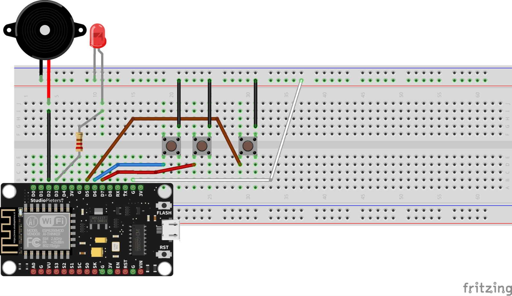
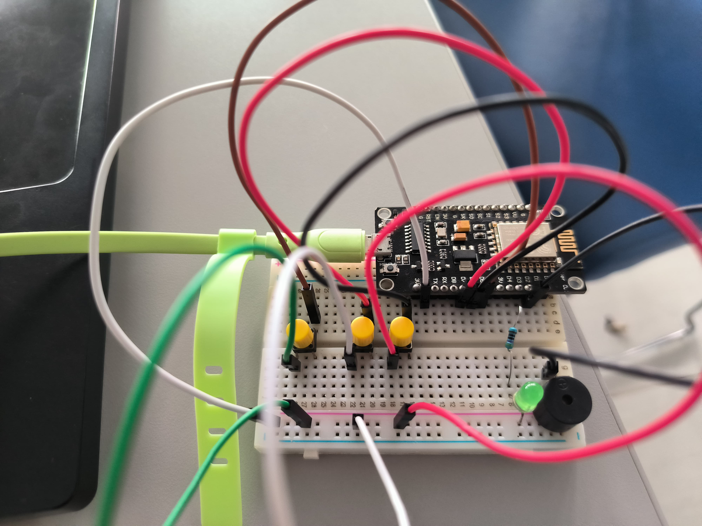

# POSTTEST 2 - PRAKTIKUN - IOT - UNMUL

**Kelompok 3 B 2021:**

  * Muhammad Irvan Hakim	    - 2109106057
  * Muhammad Dhimas Eko	      - 2109106068
  * Maulana Muhammad Hafidz 	- 2109106070

# Rangkaian untuk mengatur kecerahan lampu dan Tone/ nada buzzer 

**Deskripsi**

Rangkaian ini menghasilkan output berupa lampu LED dan Buzzer yang dapat di on/off kan serta dapat di control kecerahan dan frekuensi melalui button dan webserver yang menggunakan NodeMCU dengan mode Wifi_STA

**Ketentuan Rangkaian**

1. Kecerahan lampu bisa ditambahkan/dikurangi dengan kelipatan 3 (ex: 0, 3, 6, ..., 249, range 0-249)
2. Tone / nada Buzzer bisa ditambahkan/dikurangi dengan kelipatan 10 (ex: 100, 110, 120, 130, ..., 2500, range 100-2500)
3. Setiap board terdapat 2 button untuk menambah dan mengurangi value komponen
4. Setiap board terdapat 1 button untuk enable/disable komponen
5. WEBSERVER diperlukan untuk monitor value Komponen
6. NodeMCU harus connect ke Wi-Fi (bebas memilih mode WIFI_AP atau WIFI_STA

**Pembagian Tugas**

1. Muhammad Irvan Hakim      = Buat Kodingan dan Edit Video
2. Muhammad Dhimas Eko       = Buat Desain Skema Komponen dan Merakit Komponen
3. Maulana Muhammad Hafidz   = Merakit Komponen dan Membuat Dokumentasi README pada Github

**Komponen yang digunakan:**

1. Kabel Jumper
2. Kabel USB
3. Breadboard
4. Resistor
5. Lampu LED
6. ESP8266
7. Button
8. Buzzer 

**Design Schematic:**

**Our Schematic:**

LINK VIDEO: https://drive.google.com/file/d/15H5SsyMdvENrFcjNApdkxSLKcKfhO_yV/view?usp=drivesdk
